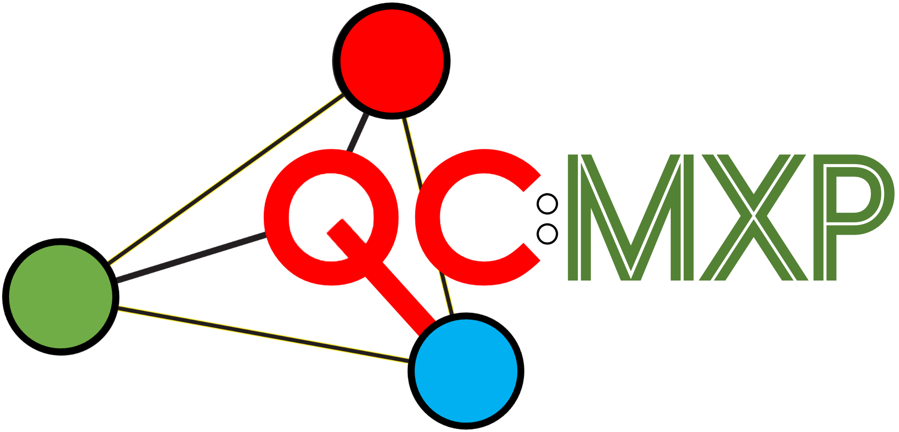
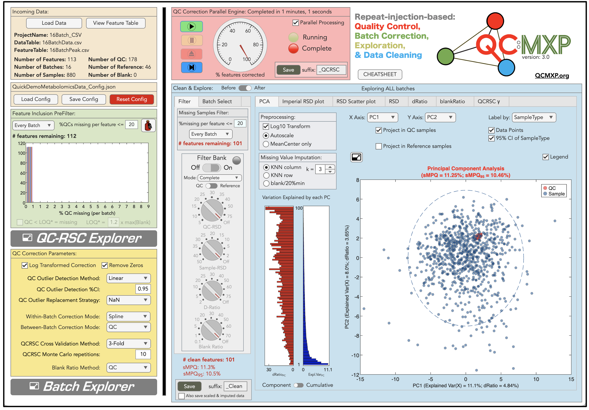
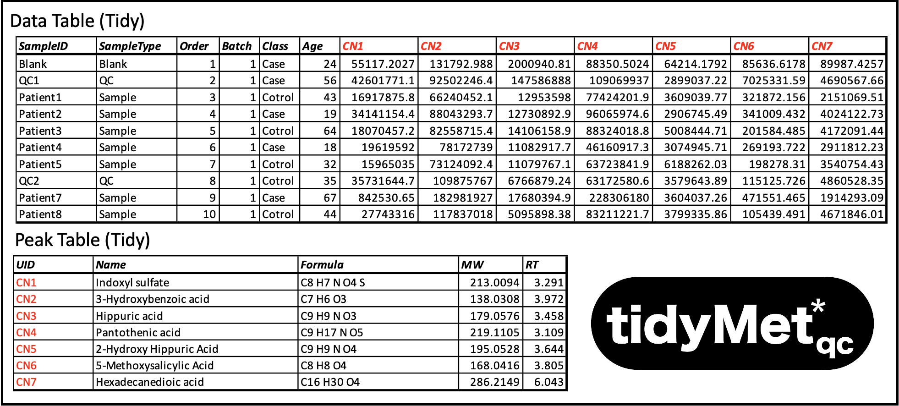

  
# Repeat-injection-based quality control, batch correction, exploration, &amp; data cleaning.

This standalone application is written specifically for the metabolomics community. It is a long overdue companion app to the publication ["Guidelines and considerations for the use of system suitability and quality control samples in mass spectrometry assays applied in untargeted clinical metabolomic studies" Metabolomics 14, 72 (2018)](https://link.springer.com/article/10.1007/s11306-018-1367-3). It can be used as an educational tool to explore the process of within and between batch correction based on repeat-injection reference samples (e.g. pooled quality control samples). However, it is designed primarly to be used as a practical tool for real world problems. It has been written as a standalone application (Mac OS, Windows 10, & Windows 11), rather than as a set of R-scripts or Python code, because I want it to be user friendly and place all of the cognative load on understanding the underlying concepts, providing process transparency, and highly visual interactive exploration of the data. As you can see from the screenshot there are many options which may seem duanting; however, extensive beta testing has shown that the learning curve is fast. That said, it is worth noting that the process of batch correction, quality control and data cleaning is not trivial and requires some thought. It should not be reduced to blindly running a third-party R-script.

   

## Tidy Data

The starting point for this software is a data matrix of *S* samples &#215; *M* features, where features are analyte concentrations, deconvoluted peak areas (i.e. generated by XCMS, Compound Discover etc) or similar, plus a linked explaination of each feature (ID code, full name etc). The data can come from any platform (GC-MS, LC-MS, NMR etc) but must be converted to my standardised QC metabolomics data sharing format *TidyMetQC* which is an extension of my generic metabolomics data sharing format *TidyMet* using the Tidy Data framework developed by [Wickham 2014](https://www.jstatsoft.org/article/view/v059i10). This format splits the information into a tidy *Data Table* (feature matrix + associated sample meta data) and tidy *Peak Table* (feature explaination). These tables can be stored as Sheets in an Excel spreadsheet or as two .csv files. Details on these formats can be found [here](https://github.com/broadhurstdavid/TidyMet) and multiple examples are provided in the [testdata folder](https://github.com/broadhurstdavid/QC-MXP/tree/main/testdata). Here is a brief example (NB: the feature IDs must be unique and link the two tables. In this case the first 7 metabolites aquired from an LC-MS in C18 Negative mode):

## Config Explorer
