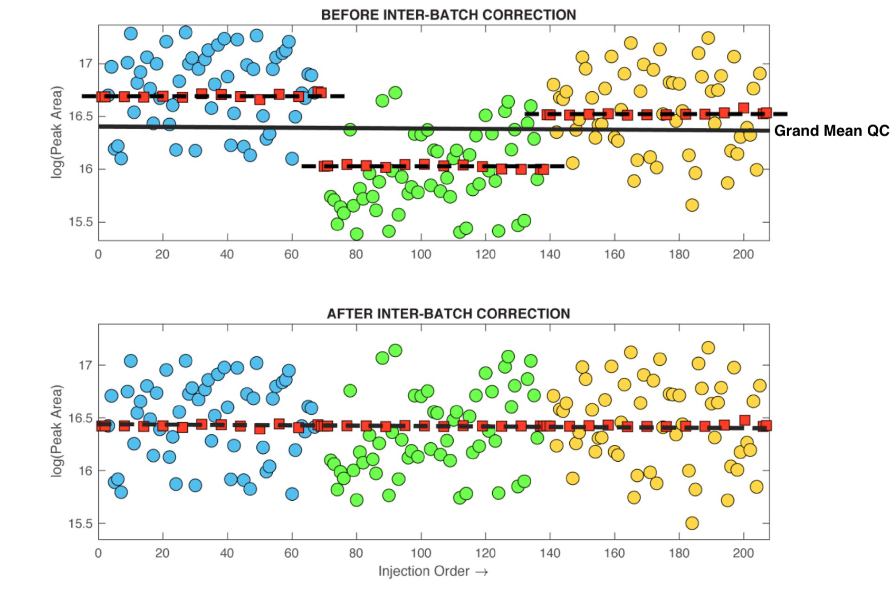
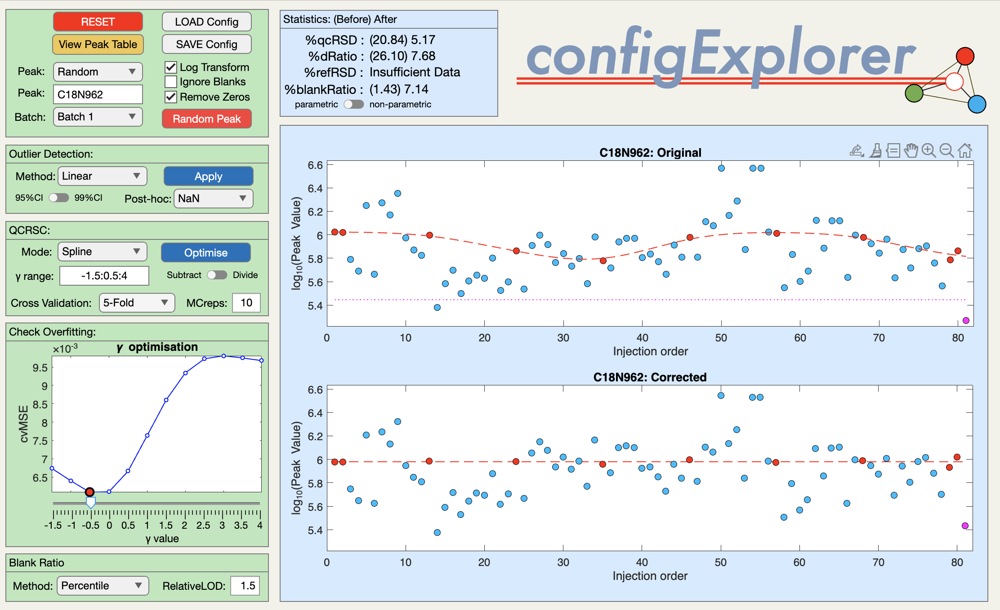
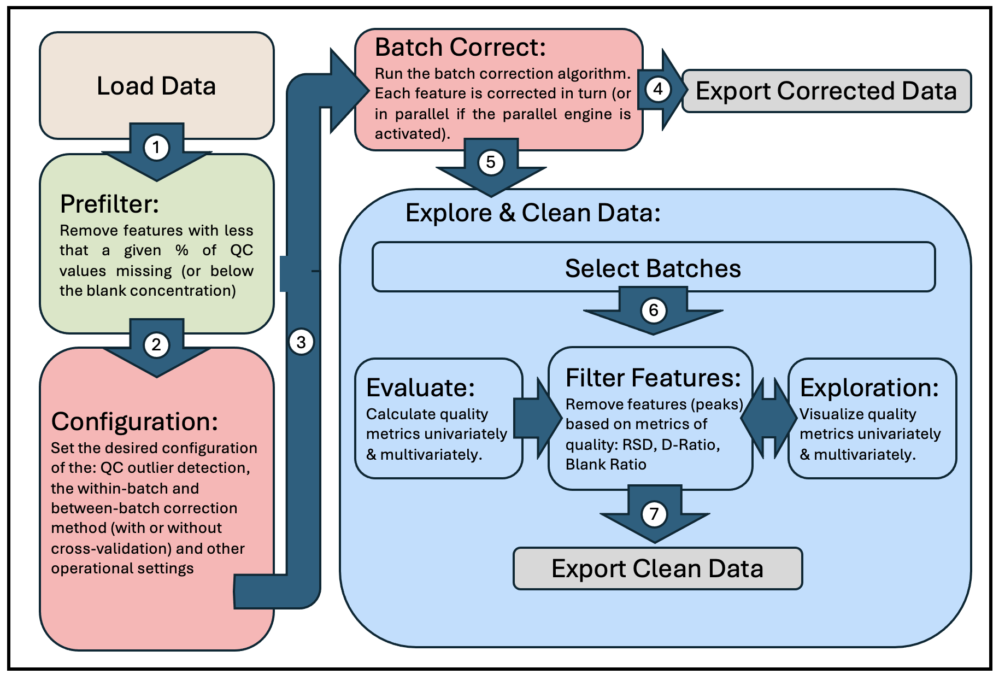
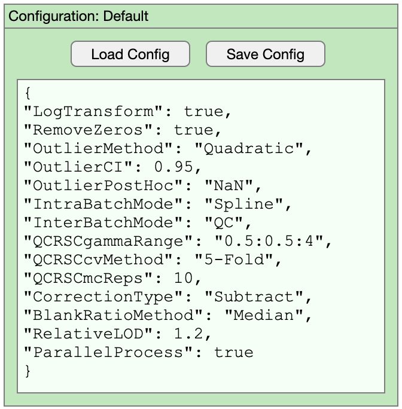
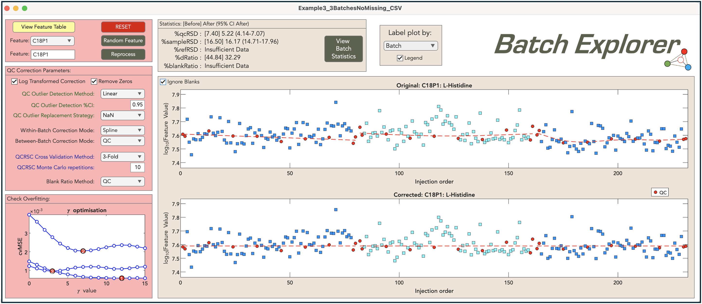
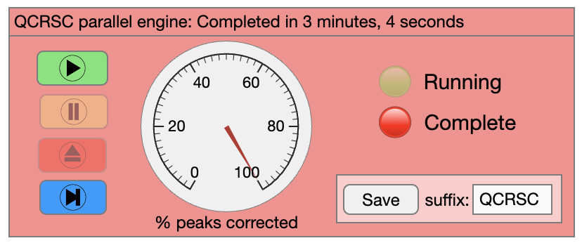
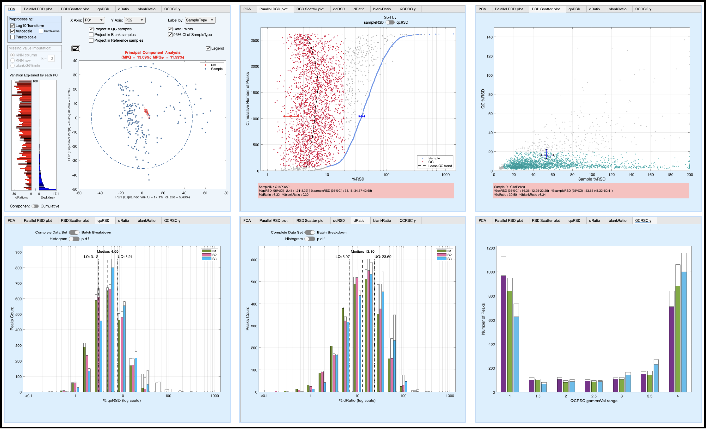

# Repeat-injection-based quality control, batch correction, exploration, &amp; data cleaning.

This standalone application is written specifically for the metabolomics community. It is a long overdue companion app to the publication ["Guidelines and considerations for the use of system suitability and quality control samples in mass spectrometry assays applied in untargeted clinical metabolomic studies" Metabolomics 14, 72 (2018)](https://link.springer.com/article/10.1007/s11306-018-1367-3). It can be used as an educational tool to explore the process of intra- and inter-batch correction based on repeat-injection reference samples (e.g. pooled quality control samples). However, it is designed primarly to be used as a practical tool for real world problems. It has been written as a standalone application (Mac OS, Windows 10, & Windows 11), rather than as a set of command line R or Python packages, because I wanted it to be user friendly, placing all of the cognative load on understanding the underlying concepts, providing process transparency, and creating a highly visual interactive exploration of the data (rather than placing the majority of the cognative load on programming skills and frustratingly installing package dependencies). I could have hosted this as a web app, but does anybody really wants to upload data to a 3rd party site?, and downloading & locally hosting a web app is beyond the interest of most people. As you can see from the screenshot there are many options, which may seem duanting. However, foundational knowledge is scafolded through interactive *Explorer* windows, and extensive beta testing has indicated that the learning curve is shallow. That said, it is worth noting that the process of batch correction, quality control, and data cleaning is non-trivial and requires some thought, education, and porject-specific investigation. It should not be reduced to blindly running a third-party "black-box" R-script with unquestioning acceptance of its effecitveness for your specific analytical workflow and precious data sets.

   

## Tidy Data
The starting point for this software is a data matrix of *S* samples &#215; *M* features, where features are analyte concentrations, aligned peaks (i.e. generated by XCMS, Compound Discover etc) or similar. This is linked to a table explaining the characteristics of each feature (ID code, full name, HMDB number etc). The data can come from any platform (GC-MS, LC-MS, NMR etc) but must be converted to my standardised QC metabolomics data sharing protocol *TidyMetqc\** which is an extension of my generic metabolomics data sharing protocol *TidyMet\** derived from the Tidy Data framework developed by [Wickham 2014](https://www.jstatsoft.org/article/view/v059i10). This format splits the information into a tidy *Data Table* (feature matrix + associated sample meta data) and tidy *Peak Table* (feature explainations). These tables can be stored as Sheets in an Excel spreadsheet or as two .csv files. Details on these formats can be found [here](https://github.com/broadhurstdavid/TidyMet) and multiple examples are provided in the [testdata folder](/testdata). Here is a brief example (NB: the feature IDs must be unique and link the two tables. In this case the first 7 metabolites aquired from an LC-MS in C18 Negative mode):

Note: The *TidyMetqc\** DataTable requires columns: "**SampleID**", "**SampleType**" ('*Blank*', '*QC*', '*Reference*', or '*Sample*'), "**Order**" (injection order) and "**Batch**" (batch number). In the example above, Columns '*Class*' & '*Age*' are included just to illustrate how this protocol allows a mixture of experiment data, domain metadata, and metabolite features.
## QCRSC
The engine that powers the application is called **QCRSC** - *Quality Control Regularised Spline Correction*. The algorithm is based around the use of regularised cubic spline modeling of repeat-injection QC samples, which are assumed to accurately represent the systematic bias (peak area 'drift') and random noise in the measurement process for each peak. The algorithm operates on each peak independently and sequentially. The basic command line version of this software (writen by me) was first reported [here](https://link.springer.com/article/10.1007/s00216-013-6856-7) & was an algorithmic improvement (speed, eligance, & robustness) of my first signal correction algorithm **QC-RLSC** *Quality Control Robust Loess Signal Correction* discussed in [Dunn, W., Broadhurst, D., Begley, P. et al. Procedures for large-scale metabolic profiling of serum and plasma using gas chromatography and liquid chromatography coupled to mass spectrometry. Nat Protoc 6, 1060–1083 (2011)](https://www.nature.com/articles/nprot.2011.335#citeas). QCRSC has been used, by me, to correct many metabolomics data sets (>30) over the last 10 years, and has been adapted (poorly) by several 3rd party groups over the years. The orginal QC-RLSC & QCRSC algorithms were implemented using the Matlab scripting language. Code has always been available on request, although I have generally performed data correction for people as a free service due to the bespoke nature of the process. It is only now that I have found time to release the algorithm in a form that I was happy share with the world without my direct supervision.
 
 
The backbone of QCRSC is a cubic spline function written by Carl de Boor (A Practical Guide to Splines. Springer-Verlag, New York: 1978). The original code was written in Fortran and called "SMOOTH". It is available as part of [PPPACK](https://www.netlib.org/pppack/). It was then implemented by Matlab as [CSAPS](https://www.mathworks.com/help/curvefit/csaps.html). It is this version of the function that is used here. For anyone interested, there is a Python modified port of CSAPS available [here](https://github.com/espdev/csaps). The degree of linearity in the spline (regularisation) is dependent on a smoothing parameter. A very small value overfits a very nonlinear curve to the QC data points and conversely a large value removes nonlinearty completely and fits a simple linear regression. Automatic selection of the smoothing parameter is important to balance the [bias-variance tradeoff](https://mlu-explain.github.io/bias-variance/). This is done using cross-validation. NOTE: if the smoothing paramater is manually fixed high (no cross-validation needed), then the correction algorithm becomes a simple linear regression correction. Alternatively, intra-batch correction can be ignored by disabling QCRSC (also called 'mean correction').
 
 
Inter-batch correction is comparatively simple. Once the Intra-batch bias has been subtracted (or divided), batches are simply concatinated such that the mean of the QC values in each batch are equalised across all batches - please refer to the figure below (taken from the [guidelines paper](https://link.springer.com/article/10.1007/s11306-018-1367-3)).
 
 
**To summerise. QCRSC operates on each feature (metabolite peak) independently. For each peak, it is a two-stage process of intra-batch correction (linear or non-linear) followed by inter-batch alignment. The intra-batch spline correction requires the optimisation of a smoothing parameter for each batch (e.g. 3 batches requires 3 individual smoothing parameters for each peak).**
 
 
*Footnote: It is worth mentioning that I have experiemented with other available smoothing spline aglorithms and empirically CSAPS is far superior for this particular situation.*
 
 

## Config Explorer
Before importing any of your own data, a great way to undertand the underlying principles of batch correction is to push the *Config Explorer* button. This launches the *Config Explorer* window with some artificaly generated example data (see below). Pressing the red button labeled *Random Peak* randomly selects one of 20 peaks. The right hand side od the window (blue) shows the before/after control charts for that peak (peak area vs injection order). The left hand side of the window (green) provides an interface to the QCRSC configuration options. This is a highly interative sandbox to play in so that you can familarise yourself with the basic functionality. Hovering over buttons/boxes will trigger pop-up information windows to hep explain the funtions. The options will be discussed in more detail in the TUTORIAL VIDEO.
 
 

## Workflow
The figure below represents the basic workflow for running QC:MXP (mapped to the corresponsing location in the application window). 
 
 

Once you have imported your own TidyMet\* data it is advisible, as a beginner, to open *Config Explorer* again. This time your own data is presented for configuration exploration (click on the batch number you want to look at). Depending on the number of QCs per batch, or the blank responses, or specific characteristics of data generated by your metabolomics platform & deconvolution software (e.g. XCMS), you may want to change the type of outlier detection, intra-batch correction method (and cross-validation method), or blank ratio assesment method. The software is designed to be very flexible. For example, if you only have 4 QC samples per batch it is unlikely that the spline correction will perform well and you may wish to constrain the algorithm to a linear correction. **Remember The configuration settings apply to all the features in the data set, across all batches, so you must check several metabolites (hit the "Random Peak" button) across multiple batches to settle on the "best" configuration settings**. This is also an oportunity to observe any unwanted artifacts that repeat across mulitple peaks (e.g. bad samples, or unexpected change in instrument sensitivity).
 
 
## Congfiguration file
When you are happy with all the configuration settings, close the window and you will be asked if you want to transfer the setting to the main application. The configuration settings have now been converted to a flat text file. It is advisable to save the current settings before proceeding. The configuration text box is editable should you wish to make any further changes. Additonal options are listed here. For example, if the data set is small you may want to switch off the parallel processor. Configuration settings are stored as plain text to enable users to transparently archive the settings making them readily available for publication or repeat processing. 
 
 

## Peak Explorer
Before applying *QCRSC* to the complete data set it is worth opening *peakExplorer*. This window is similar to *configExplorer* in that you can investigate the effects of the configuration setting on individual metabolite features. However, now you can look at the effects of both the intra and inter-batch correction. 
 
 

 
 
## Runtime
After pressing the 'play' button on the QCRSC engine. The QCRSC algorithm will be applied to each peak (feature) in the data set. Upon completion a new corrected Data table has been created and the Peak table has been updated to include basic statistical measures (QCRSD, D-Ratio, Blank Ration, percent missing etc). It is advisable to save the corrected data at this point. 
 
 

## Data Cleaning & Exploration
Once the QCRSC engine has finished attention shifts to the data cleaning filters and visualisation tabs. Peaks (metabolite features) can be filtered (removed) by Number of missing values, RSD threshold, D-Ratio threshold, and Blank-Ratio threshold. Typical settings are: Missing < 20%, QC-RSD < 20%, D-Ratio < 40%, Blank-Ratio < 20%. The effects of the QCRSC correction + filtering are shown in muliple tabs. Interpretation of these plots are discussed in the TUTORIAL VIDEO. Once you are happy with the data cleaning process, save the resulting Data table and Peak table. 
 
 

 
 

