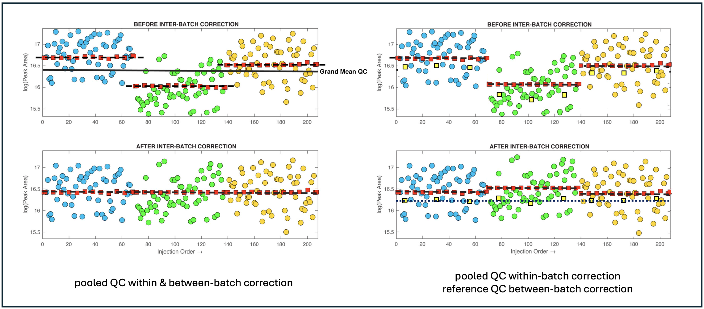

# Repeat-injection-based quality control, batch correction, exploration, & data cleaning.

This standalone application is written specifically for the metabolomics community. It is a long overdue companion app to the publication ["Guidelines and considerations for the use of system suitability and quality control samples in mass spectrometry assays applied in untargeted clinical metabolomic studies" Metabolomics 14, 72 (2018)](https://link.springer.com/article/10.1007/s11306-018-1367-3). It can be used as an educational tool to explore the process of intra- and inter-batch correction based on repeat-injection reference samples (e.g. pooled quality control samples). However, it is designed primarly to be used as a practical tool for real world problems. It has been written as a standalone application (Mac OS, Windows 10, & Windows 11), rather than as a set of R-scripts or Python code, because I want it to be user friendly and place all of the cognative load on understanding the underlying concepts, providing process transparency, and highly visual interactive exploration of the data. As you can see from the screenshot there are many options which may seem duanting; however, extensive beta testing has shown that the learning curve is fast. That said, it is worth noting that the process of batch correction, quality control and data cleaning is not trivial and requires some thought. It should not be reduced to blindly running a third-party R-script.

   

## Tidy Data
The starting point for this software is a data matrix of *S* samples &#215; *M* features, where features are analyte concentrations, deconvoluted peak areas (i.e. generated by XCMS, Compound Discover etc) or similar, plus a linked explaination of each feature (ID code, full name etc). The data can come from any platform (GC-MS, LC-MS, NMR etc) but must be converted to my standardised QC metabolomics data sharing protocol *TidyMetqc\** which is an extension of my generic metabolomics data sharing protocol *TidyMet\** using the Tidy Data framework developed by [Wickham 2014](https://www.jstatsoft.org/article/view/v059i10). This format splits the information into a tidy *Data Table* (feature matrix + associated sample meta data) and tidy *Peak Table* (feature explainations). These tables can be stored as Sheets in an Excel spreadsheet or as two .csv files. Details on these formats can be found [here](https://github.com/broadhurstdavid/TidyMet) and multiple examples are provided in the [testdata folder](https://github.com/broadhurstdavid/QC-MXP/tree/main/testdata). Here is a brief example (NB: the feature IDs must be unique and link the two tables. In this case the first 7 metabolites aquired from an LC-MS in C18 Negative mode):

Note: The *TidyMetqc\** DataTable requires columns: "**SampleID**", "**SampleType**" ('*Blank*', '*QC*', '*Reference*', or '*Sample*'), "**Order**" (injection order) and "**Batch**" (batch number). 
## QCRSC
The engine that powers this application is called **QCRSC** - *Quality Control Regularised Spline Correction*. This is the algorithm that corrects intra-batch systematic peak-area bias (or peak-area 'drift') based on regularised cubic spline modeling of repeat-injection QC samples. The operates on each peak sequentially and independently. The basic version of this software (writen by me) was first reported [here](https://link.springer.com/article/10.1007/s00216-013-6856-7) & was an algorithmic improvement (speed, eligance, & robustness) of my first signal correction algorithm **QC-RLSC** *Quality Control Robust Spline Signal Correction* discussed in [Dunn, W., Broadhurst, D., Begley, P. et al. Procedures for large-scale metabolic profiling of serum and plasma using gas chromatography and liquid chromatography coupled to mass spectrometry. Nat Protoc 6, 1060–1083 (2011)](https://www.nature.com/articles/nprot.2011.335#citeas). QCRSC has been used, by me, to correct many metabolomics data sets over the last 10 years, and has been adapted (poorly) by several other groups over the years. The orginal QC-RLSC & QCRSC algorithms were written using the Matlab scripting language and has always been available on request, although I have generally performed data correction for people as a free service. It is only now that I have found time to release the algorithm in a form that I was happy share with the world without my direct supervision.
 
 
The backbone of QCRSC is a cubic spline function written by Carl de Boor (A Practical Guide to Splines. Springer-Verlag, New York: 1978). The original code was written in Fortran and called "SMOOTH" it is available as part of [PPPACK](https://www.netlib.org/pppack/). It was then implemented by Matlab as [CSAPS](https://www.mathworks.com/help/curvefit/csaps.html). It is this version of the function that is used here. There is a Python modified port of CSAPS avialable [here](https://github.com/espdev/csaps) for anyone interested. The degree of linearity in the spline (regularisation) is dependent on a smoothing parameter. A very small value overfits a very nonlinear curve to the QC data points and a large value removes nonlinearty completely and fits a linear regression. Automatic selection of the smoothing parameter is important to optimise the [bias-variance tradeoff](https://mlu-explain.github.io/bias-variance/). This is done using cross-validation. NOTE: if the smoothing paramater is manually set high, then the correction algorithm becomes simply a linear correction. Alternatively, intra-batch correction can be ignored by disabling QCRSC.
 
 
Inter-batch correction is simple. Once the Intra-batch bias has been subtracted (or divided), batches are simply concatinated such that the mean of the QC values in each batch are equalised across all batches - please refer to the figure below (taken from the [guidelines paper](https://link.springer.com/article/10.1007/s11306-018-1367-3)).
 
 

## Config Explorer
