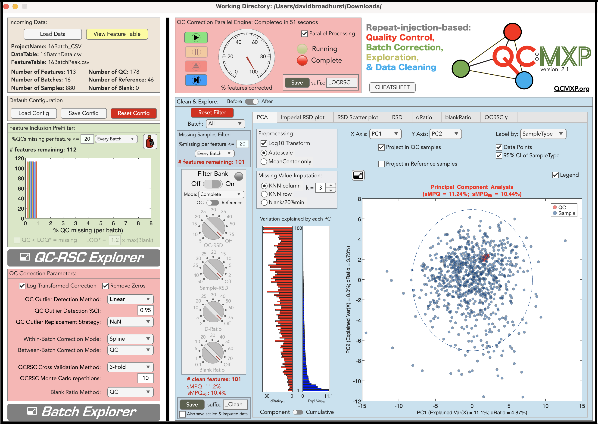
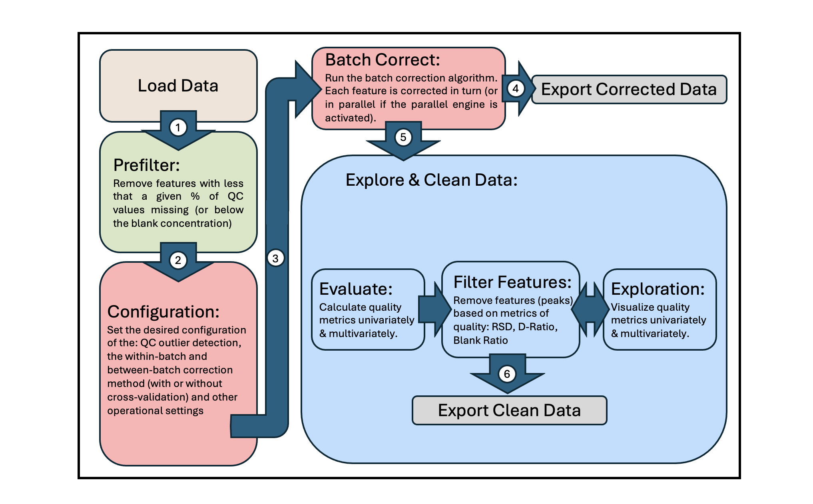
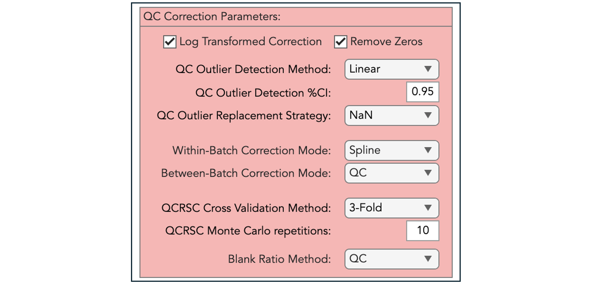

   

  

   
 

 
 
This [GitHub repository](https://github.com/broadhurstdavid/QC-MXP) contains the binary installation files (Apple OSX & Microsoft Windows) and the Matlab source code for the metabolomics standalone application *QC:MXP* written by [Professor David Broadhurst](http://www.davidbroadhurst.net). You can cite this package as follows: 
>Broadhurst, D.I. (2023). *QC:MXP Repeat Injection based Quality Control, Batch Correction, Exploration & Data Cleaning* (version 1.1) Zendono. <https://doi.org/10.5281/zenodo.11185244>. Retrieved from <https://github.com/broadhurstdavid/QC-MXP.>
 

1. [Introduction](#introduction)
2. [Tidy Data](#tidy-data)
3. [QCRSC - Quality Control Regularised Spline Correction](#qcrsc)
4. [Config Explorer - learn how to optimise QCRSC](#config-explorer)
5. [Operational Workflow](#operational-workflow)
6. [Configuration File](#congfiguration-file)
7. [Peak Explorer - interrogate proposed correction of a given peak](#peak-explorer)
8. [Correct the whole data set](#correct-the-whole-data-set)
9. [Data Cleaning & Exploration](#data-cleaning--exploration)
10. [CHEAT SHEET](#cheat-sheet)
11. [How to Download & Install QCMXP](#how-to-download--install-qcmxp)
12. [Source Code](source-code)

## Introduction
This standalone application is written specifically for the metabolomics community. It is a long overdue companion app to the publication ["Guidelines and considerations for the use of system suitability and quality control samples in mass spectrometry assays applied in untargeted clinical metabolomic studies" Metabolomics 14, 72 (2018)](https://link.springer.com/article/10.1007/s11306-018-1367-3). It can be used as an educational tool to explore the process of intra- and inter-batch correction based on repeat-injection reference samples (e.g. pooled quality control samples); however, it is designed primarily to be used as a practical tool for real world problems. It has been written as a standalone application (Mac OS, Windows 10, & Windows 11) rather than as a set of command line R or Python packages, because I wanted it to be user friendly, placing all of the cognitive load on understanding the underlying concepts, providing process transparency, and creating a highly visual interactive exploration of the data (rather than placing the majority of the cognitive load on programming skills and frustratingly installing package dependencies). As you can see from the screenshot there are many options, which may seem daunting. However, foundational knowledge is scaffolded through interactive *Explorer* windows, and extensive beta testing has suggested that the learning curve is shallow. That said, it is worth noting that the process of batch correction, quality control, and data cleaning is non-trivial and requires some thought, education, and project-specific investigation.

   

## Tidy Data
The starting point for this software is a data matrix of *S* samples &#215; *M* features, where features are analyte concentrations, aligned peaks (i.e. generated by XCMS, Compound Discover etc) or similar. This matrix is linked to a table explaining the characteristics of each feature (ID code, full name, HMDB number, etc). The data can come from any platform (GC-MS, LC-MS, NMR, etc) but must be converted to my standardised QC metabolomics data sharing protocol *TidyMetqc\** which is an extension of my generic metabolomics data sharing protocol *TidyMet\** derived from the Tidy Data framework developed by [Wickham 2014](https://www.jstatsoft.org/article/view/v059i10). This format splits the information into a tidy *Data Table* (feature matrix + associated sample meta data) and tidy *Peak Table* (feature explanations). These tables can be stored as Sheets in an Excel spreadsheet or as two .csv files. Details on these formats can be found [here](https://github.com/broadhurstdavid/TidyMet) and multiple examples are provided in the [testdata directory](https://github.com/broadhurstdavid/QC-MXP/tree/main/testdata). Here is a brief example (NB: the feature IDs must be unique and link the two tables. In this case the first 7 metabolites acquired from an LC-MS in C18 Negative mode):

Note: The *TidyMetqc\** DataTable minimally requires columns: "**SampleID**", "**SampleType**" ('*Blank*', '*QC*', '*Reference*', or '*Sample*'), "**Order**" (injection order) and "**Batch**" (batch number). In the example above, Columns '*Class*' & '*Age*' are included just to illustrate how this protocol allows a mixture of experiment data, domain metadata, and metabolite features. PeakTable minimally requires only columns “**UID**" and "**Name**". 
## QCRSC
The engine that powers the application is called **QCRSC** - *Quality Control Regularised Spline Correction*. The algorithm is based around the use of regularised (smoothing) cubic spline modelling of repeat-injection QC samples, which are assumed to accurately represent the systematic bias (peak area 'drift') and random noise (in the measurement process) for each peak. The algorithm operates on each peak independently and sequentially. The basic command line version of this software (written by me) was first reported [here](https://link.springer.com/article/10.1007/s00216-013-6856-7) & was an algorithmic improvement (speed, elegance, & robustness) of my first signal correction algorithm **QC-RLSC** *Quality Control Robust Loess Signal Correction* discussed in [Dunn, W., Broadhurst, D., Begley, P. et al. Procedures for large-scale metabolic profiling of serum and plasma using gas chromatography and liquid chromatography coupled to mass spectrometry. Nat Protoc 6, 1060–1083 (2011)](https://www.nature.com/articles/nprot.2011.335). QCRSC has been used, by me, to correct many metabolomics data sets (>30) over the last 10 years, and has been adapted (often poorly) by several 3rd party groups over the years. The original QC-RLSC & QCRSC algorithms were implemented using the Matlab scripting language. Code has always been available on request, although I have generally performed data correction for people as a free service due to the bespoke nature of the process. It is only now that I have found time to release the algorithm in a form that I was happy share with the world without my direct supervision. 
 
 
The backbone of QCRSC is a cubic spline function written by Carl de Boor (A Practical Guide to Splines. Springer-Verlag, New York: 1978). The original code was written in Fortran and called "SMOOTH". It is available as part of [PPPACK](https://www.netlib.org/pppack/). It was then implemented by Matlab as [CSAPS](https://www.mathworks.com/help/curvefit/csaps.html). It is this version of the function that is used here. For anyone interested, there is a Python modified port of CSAPS available [here](https://github.com/espdev/csaps). The degree of linearity in the spline (regularisation) is dependent on a smoothing parameter. A very small value overfits a very nonlinear curve to the QC data points and conversely a large value removes nonlinearity completely and fits a simple linear regression. Automatic selection of the smoothing parameter is important to balance the [bias-variance tradeoff](https://mlu-explain.github.io/bias-variance/). This is done using cross-validation. NOTE: if the smoothing parameter is manually fixed high (no cross-validation needed), then the correction algorithm becomes a simple linear regression correction (as of Version 1.1 the 'Linear' option has been implemented using Robust (bisquare) linear regression). Alternatively, intra-batch correction can be ignored by disabling QCRSC (also called 'mean correction').
 
 
Inter-batch correction is comparatively simple. Once the Intra-batch bias has been subtracted (or divided), batches are simply concatenated such that the mean of the QC values in each batch are equalised across all batches - please refer to the figure below (taken from the [guidelines paper](https://link.springer.com/article/10.1007/s11306-018-1367-3)).
 
 
**To summarise: QCRSC operates on each feature (metabolite peak) independently. For each peak, it is a two-stage process of intra-batch correction (linear or non-linear) followed by inter-batch alignment. The intra-batch spline correction requires the optimisation of a smoothing parameter for each batch (e.g. 3 batches requires 3 individual smoothing parameters for each peak).**
 
 
*Footnote: The are many published alternatives to QCRSC. I am not going to list them here. Many claim to be superior based on comparison of only a couple of specific data sets. I would suggest that, given sufficient QC data, it is likely that most are equally ‘fit for purpose’ within reasonable confidence intervals. More important is the lab based design of experiment (i.e. number of samples in a batch, number of QCs in a batch, frequency of QC, inclusion of sufficient Blanks). Any nonlinear correction algorithm is going to be crippled by a low number and/or frequency of QC sample injection. So, if in doubt use a simple batch-wise ‘linear’ correction method over any complex machine learning method. Finally, be wary of any method that celebrates the ability to automatically detect batches. Batch number is as easy to provide as the injection order, so should be used by the algorithm.*
 
 

## Config Explorer
Before importing any of your own data, a great way to understand the underlying principles of intra-batch correction is to push the *Config Explorer* button. This launches the *Config Explorer* window with some artificially generated example data (see below). Pressing the red button labeled *Random Peak* randomly selects one of 20 peaks. The right hand side of the window (blue) shows the before/after control charts for that peak (peak area vs injection order). The left hand side of the window (green) provides an interface to the QCRSC configuration options. This is a highly interactive sandbox allowing you can familiarise yourself with the basic functionality - so ‘go play!’. Hovering over buttons/boxes will trigger pop-up information windows to help explain the functions. The options will be discussed in more detail in the TUTORIAL VIDEO.
 
 

## Operational Workflow
The figure below represents the general operational workflow for running QC:MXP (mapped to the corresponding location in the application window). 
 
 

Once you have imported your own TidyMet\* data it is advisable, as a beginner, to again open *Config Explorer*. This time your own data is presented for configuration exploration (click on the batch number you want to look at). Depending on the number of QCs per batch, or the blank responses, or specific characteristics of data generated by your metabolomics platform & deconvolution software (e.g. XCMS), you may want to change the type of outlier detection, intra-batch correction method (and cross-validation method), or blank ratio assessment method. The software is designed to be very flexible. For example, if you only have 4 QC samples per batch it is unlikely that the spline correction will perform well and you may wish to constrain the algorithm to a linear correction. **Remember The configuration settings apply to all the features in the data set, across all batches, so you must review several metabolites (hit the "Random Peak" button) across multiple batches to settle on the "best" configuration settings**. This is also an opportunity to observe any unwanted artefacts that repeat across multiple peaks (e.g. bad samples, or unexpected change in instrument sensitivity).
 
 
## Configuration File
When you are happy with all the configuration settings, close the window and you will be asked if you want to transfer the setting to the main application. The configuration settings have now been converted to a flat text file. It is advisable to save the current settings before proceeding. The configuration text box is editable should you wish to make any further changes. Some additional options to are included in this window. For example. if your data set is small you may want to switch off the parallel processor, as it sometimes takes longer to start the parallel engine than to complete the full correction. Configuration settings are stored as plain text to enable users to transparently archive the settings making them readily available for publication or repeat processing. The function and choices for each configuration setting is explained in the [CHEAT SHEET](https://github.com/broadhurstdavid/QC-MXP/blob/main/docs/CheatSheet.pdf) 
 
 

## Peak Explorer
Before applying *QCRSC* to the complete data set it is worth opening *peakExplorer*. This window is similar to *configExplorer* in that you can investigate the effects of the configuration setting on individual metabolite features. However, now you can look at the effects of both the intra and inter-batch correction. 
 
 

 
 
## Correct the whole data set
To run QCRSC on the whole data set press the green 'play' button on the QCRSC engine. The QCRSC algorithm will be applied to each peak (feature) in the data set. Upon completion a new corrected Data table has been created and the Peak table has been updated to include basic statistical measures (QC-RSD, D-Ratio, Blank Ration, percent missing etc). It is advisable to save the corrected data at this point. 
 
 

## Data Cleaning & Exploration
Once the QCRSC engine has finished attention shifts to the data cleaning filters and visualisation tabs. Peaks (metabolite features) can be filtered (removed) by Number of missing values, RSD threshold, D-Ratio threshold, and Blank-Ratio threshold. Typical settings are: Missing < 20%, QC-RSD < 20%, D-Ratio < 40%, Blank-Ratio < 20%. The effects of the QCRSC correction + filtering are shown in multiple tabs. Interpretation of these plots are discussed in the TUTORIAL VIDEO. Once you are happy with the data cleaning process, save the resulting Data table and Peak table. 
 
 

 
 
## TUTORIAL VIDEO
**Coming Soon**
## CHEAT SHEET
There is a pdf explaining the QC-MXP & QCRSC options [here](https://github.com/broadhurstdavid/QC-MXP/blob/main/docs/CheatSheet.pdf).
## How to Download & Install QCMXP
The binary installation files are found in the [latest release section of the repository](https://github.com/broadhurstdavid/QC-MXP/releases/latest). Choose the one that matches your operating system (Apple Intel or Apple Silicon, Windows 10, Windows 11, or Matlab App). Download (unzip if Apple) and run. The helper app will guide you through installation. Note: For Apple users, once installed, application can be found in '/Applications/QCMXP/application' (unless you customized your install). Maybe pin the app to your Dock once opened.
 
 
This application is free, but is built on top of the Matlab Runtime libraries (also free). This means installation can be slow as the runtime libraries must first be installed. It also takes while to launch (without a splash screen). This is particualrly true on the first time of running. So please be patient. Do not be alarmed by any Matlab procesess running in the background. This is completely normal. Any minor update to the software will not require updating the runtime libraries so will install very quickly.
## Source Code
This software was developed using the *Matlab App Designer*. All the Matlab source code can be found in the [mlapp](https://github.com/broadhurstdavid/QC-MXP/tree/main/mlapp) directory. It is probably not the best documented code. The core QCRSC code is 'QCRSC.m' & 'optimiseCSAPS.m' (and of course [csaps.m](https://www.mathworks.com/help/curvefit/csaps.html)) & maybe 'OutlierFilter.m' for the outlier detection algorithms (primarily based on Matlab [polyfit](https://www.mathworks.com/help/matlab/ref/polyfit.html) functions). The only other thing of note is the preprocessing & missing value imputation for the PCA plot ('PCApreprocessing.m'). KNN imputation is either based on the Matlab function [knnimpute](https://www.mathworks.com/help/bioinfo/ref/knnimpute.html) or an incremental KNN algorithm written by me, but inspired by [Ki-Yeol Kim et al.](https://bmcbioinformatics.biomedcentral.com/articles/10.1186/1471-2105-5-160). Everything else is window dressing :-).

